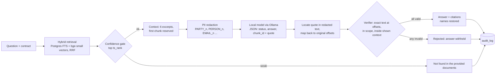

# contract-qa-eval

[](https://github.com/vanshtaneja23/contract-qa-eval/actions/workflows/ci.yml)

Ask a question about a contract → get an answer with citations to the exact clause text →
and know which open-weight model (run locally via Ollama) does this most reliably.

**Why:** legal AI fails worst when it is *confidently wrong*: a fluent answer with a plausible
citation that the contract doesn't actually say. This project makes every citation checkable
character by character, refuses to show answers whose citations don't verify, and measures how
often each model would still mislead a user.

> **No paid or frontier models were run.** Every model result here comes from open-weight models
> running locally via Ollama on one laptop, at $0 API cost. Adapters for Anthropic and OpenAI
> exist and are tested against fixtures only; real paid clients refuse to start unless
> `CQA_ALLOW_PAID_CALLS=1`. Every number below comes from a real run, with its command and date.

## Results: open-weight models on 120 CUAD questions (M5)

`uv run cqa-eval answer-eval --model ollama:<model>` for each model, then `uv run cqa-eval judge`
and `uv run cqa-eval m5-report`; run 2026-10-08. Same retrieval, same 6-excerpt context, same
prompt, PII redacted; only the model differs. 120 questions: 90 where the clause exists, 30
where it does not. Full report: [eval/results/report.md](eval/results/report.md).

| model | accuracy (95% CI) | abstains on absent clause | citation validity | confidently wrong (shown) | confidently wrong (before verifier) | p50 / p95 latency | cost / 100 Qs |
|---|---|---|---|---|---|---|---|
| `llama3.1:8b` | 46% [38%, 55%] | 80% | 71% | 18% | 37% | 6.6 s / 10.2 s | $0 (local) |
| `qwen2.5:7b` | 54% [45%, 63%] | 87% | 86% | 18% | 27% | 6.7 s / 10.9 s | $0 (local) |
| `gemma2:9b` | 50% [41%, 59%] | 77% | 80% | 23% | 37% | 11.4 s / 17.2 s | $0 (local) |

**Hardware:** Apple M4 Pro, 24 GB unified memory, Ollama 0.40.1, one model loaded at a time;
4-bit weights (llama3.1:8b and qwen2.5:7b Q4_K_M, gemma2:9b Q4_0).

**How to read it**
- **Accuracy** = correct answers to answerable questions plus correct abstentions on absent
  clauses, over all 120. Answer correctness is judged by a local LLM judge (`qwen2.5:14b`, a
  different, larger model than those graded); abstentions and absent-clause answers are scored by
  rule. **Citation validity** = share of a model's answers whose every quote verified.
- **The models are not statistically separable.** qwen2.5:7b leads on every point estimate, but
  no paired accuracy difference excludes zero (qwen − llama: +8.3 pts, 95% CI [−0.8, +17.5]).
  The answer prompt was also tuned on qwen2.5:7b (dev split), which may favour it.
- **The robust finding is the verifier:** models asserted wrong or unverifiable answers on
  27–37% of questions; after the verifier withholds answers whose quotes don't check out, the
  wrong answers a user would see drop to 18–23%.
- **The judge is not yet validated.** The 30 human labels are pending (`uv run cqa-eval label`).
  In the failure examples the judge is visibly too strict at times (e.g. it marked a correct
  "ACCURAY INCORPORATED and SIEMENS AKTIENGESELLSCHAFT" answer wrong over legal-name formatting), so
  judged accuracy likely understates all three models.

## How it works



- **Offsets are the source of truth.** Chunks store character offsets into the unmodified
  contract; a DB `CHECK` enforces `char_length(text) = end - start`. The model never produces
  offsets: it returns a chunk id and a quote, code finds the quote, and an independent verifier
  re-checks `text[start:end] == quoted_text`. One invalid citation rejects the whole answer.
- **Redaction** replaces organisations, people (signature/notice patterns), emails, phones and
  street addresses with per-document placeholders before any model call, and maps them back in
  answers and citations. `audit_log` records entity types and counts, never values.

## Retrieval (M2)

375 answerable questions (20 CUAD categories × 40 contracts), retrieval scoped to the contract
being asked about; a hit = a retrieved chunk overlapping a CUAD gold span; 95% bootstrap CIs.
`uv run cqa-eval retrieval-eval --label 'windows / bge-small (chosen)' --embedding bge-small`,
2026-10-03, commit 807abd3:

| method | recall@5 (95% CI) | MRR@10 (95% CI) |
|---|---|---|
| Postgres full-text (`ts_rank`) | 0.72 [0.68, 0.77] | 0.58 [0.54, 0.62] |
| BM25 (reference implementation) | 0.72 [0.68, 0.77] | 0.60 [0.56, 0.64] |
| vector (bge-small-en-v1.5, local) | 0.72 [0.67, 0.77] | 0.52 [0.48, 0.56] |
| **hybrid (full-text + vector, RRF)** | **0.75 [0.71, 0.80]** | **0.61 [0.57, 0.65]** |

Hybrid beats full-text alone by +0.029 recall@5 (paired 95% CI [+0.003, +0.056]). A
section-aware chunker was built, measured, and removed because it didn't help. Full tables:
[eval/results/retrieval.md](eval/results/retrieval.md).

## Other measured design choices

| choice | evidence | command / date |
|---|---|---|
| 6-chunk context with the first chunk reserved | context recall 0.864 vs 0.768 for top-6 (+0.096, 95% CI [+0.064, +0.131]); Parties 0.25 → 1.00 | `cqa-eval context-eval`, 2026-10-04 |
| confidence gate on top `ts_rank` | AUC 0.845 dev / 0.725 held-out; skips 4 of 30 absent-clause eval questions, 0 of 90 answerable | `cqa-eval gate-calibrate`, 2026-10-04 |
| prompt v2 (stop over-abstaining) | grounded accuracy 0.375 → 0.525 on 40 dev questions (+0.150, CI [−0.050, +0.325], not significant) | `cqa-eval answer-eval --split dev`, 2026-10-08 |
| PII redaction | grounded accuracy 0.525 → 0.525 on 40 dev questions (CI [−0.100, +0.100]); 296 entities redacted | same, with/without `--no-redact`, 2026-10-08 |

Every choice, its alternative and its evidence: [DECISIONS.md](DECISIONS.md).

## Security model

- **PII redaction before every model call** (above), even for local models, so the same
  pipeline is safe to point at an external API. Single-document questions only (placeholders
  are numbered per document).
- **Matter consistency in the database:** `chunks.matter_id` is tied to its document's matter
  by a composite foreign key, so a chunk can't be filed under the wrong client's matter.
- **Audit log** of every question: who, which matter, outcome, rejection reasons, redaction
  counts.
- **Not implemented yet:** row-level security (M4). Nothing at the database level stops a
  query from reading another matter's chunks; scoping is enforced in application code only.
- **Secrets:** `.env` is gitignored; a pre-commit hook and CI scan block committed keys.

## Run it

Requires Docker, [uv](https://docs.astral.sh/uv/), Node 20+ and [Ollama](https://ollama.com).

```bash
cp .env.example .env
make setup                                  # deps + pre-commit secret scanner
make ingest                                 # Postgres+pgvector, migrations, CUAD, 40 contracts
uv run cqa-eval embed --model bge-small     # local embeddings
ollama pull qwen2.5:7b && ollama serve      # in another terminal
uv run cqa-eval answer-eval --model ollama:qwen2.5:7b --limit 20
make check                                  # lint, types, all tests, web typecheck + lint
```

Model responses are cached on disk (`eval/cache/`, committed), keyed by model, settings and
prompt. Re-run any eval with `--offline` to reproduce it from the cache without calling a model.

## Limitations

- **Small eval:** 40 of CUAD's 510 contracts, 120 questions, 20 of 41 categories. Model
  differences of under ~10 points can't be resolved at this size.
- **Judge not yet validated** against human labels (pending), and visibly strict in places.
- **Ground-truth quirks:** CUAD separates "Agreement Date" from "Effective Date", so answering
  "When was this agreement made?" with an effective-date clause scores as wrong; one gold answer
  is an unfilled template ("the ____ day of ______, 2000").
- **Prompt tuned on one model** (qwen2.5:7b), on a dev split disjoint from the eval set.
- **Redaction is regex-based:** names in running prose and organisations without a corporate
  suffix are missed.
- **Local 4-bit 7–9B models only**; frontier models were not evaluated.
- Not legal advice.

## What I'd do next

1. Collect the 30 human labels and report judge agreement; recalibrate or replace the judge if
   kappa is low.
2. Row-level security (M4) with Testcontainers tests proving cross-matter isolation.
3. Grow the eval (more contracts and categories) until model differences are resolvable.
4. NER-based redaction (e.g. Presidio) measured against the regex baseline.
5. FastAPI endpoints and the TypeScript UI with clickable, highlighted citations (M6).

## Status

- [x] M1 Repo, schema, offset-exact ingestion
- [x] M2 Retrieval comparison
- [x] M3 Cited answers, verifier, confidence gate
- [x] PII redaction (pulled forward from M4) with measured cost
- [x] M5 Model comparison on local open-weight models (judge validation pending human labels)
- [ ] M4 Row-level security
- [ ] M6 API and frontend
- [x] CI (lint, types, unit, integration with pgvector, web)

## Data

Uses [CUAD v1](https://github.com/TheAtticusProject/cuad) by The Atticus Project, licensed
CC BY 4.0. See [DATA.md](DATA.md) for attribution and how the subset is pinned.
